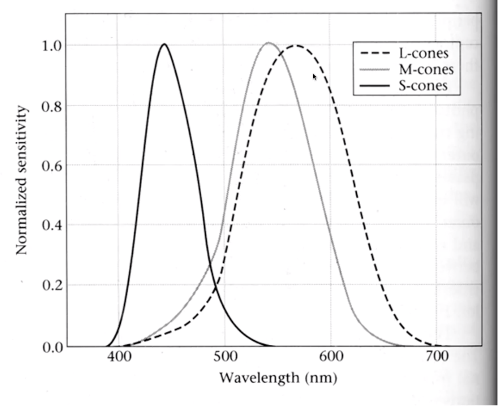
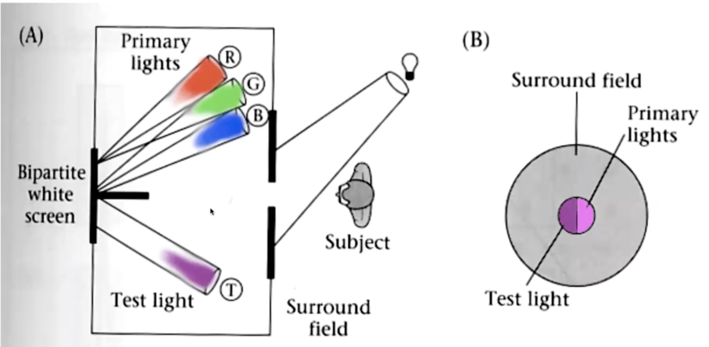

The Table of Contents:

- [Color Physics](#2-color-physics)
  - [Motivation Question](#motivation-question)
  - [The Physics of Light](#the-physics-of-light)
  - [Photon](#photon)
  - [Radiometry](#radiometry)
  - [Reflectance spectra of surfaces](#reflectance-spectra-of-surfaces)

## 2. Color Physics

### Motivation Question
**Why does a visual system need color?**
To tell what food is edible, to distinguish material changes from shading
changes, to group parts of one object together in a scene...

### The Physics of Light
- Any patch of light can be completely described physically by its spectrun: the number of photons (per time unit) at each wavelength 400 - 700 nm.

   
  

  
- Example of light sources:

  

  
- Colors and complements:

  

- **Additive color mixing**:
  - Colors combine by *adding* color spectra
  - Light adds to black
  - Ex. Cathode Ray Tube phosophors, multiple projectors

  

- **Subtractive color mixing**:
  - Colors combine by *multiplying* color spectra
  - Pigments remove color from incident light (white) 
  - Ex. Printing on paper, crayons, most photographic film

  

### Photon
Different possibilities when a photon is emitted:
- **Absorption**: photon absorbed by the surface
- **Diffuse reflection** (diffusion): reflected to any other directions with uniform distribution 
- **Specular Reflection**: reflected with respect to the normal vector of the surface
- **Transparency**: the photon may go through the surface
- **Refraction**: the photon goes through the surface but there is reflection within the surface
- **Flurorescence**: the outgoing photon wavelength is different from the incoming wavelength, and results in a change of colors
- **Subsurface scattering**: photon arrives in a certain surface position, but leaves from different positions
- **Phosphorescence**: there is a delay when the photon leaves the surface
- **Interreflection**: multiple surfaces causing multiple reflections

### Radiometry
- **Radiance**: power emitted per unit area in a direction - directions specified by polor angle and azimuth
- **Irradiance**: total incident power falling on a surface 

  

- **Bidirectional reflectance distribution function**: 
Model of local reflection that tells how *bright* a surface appears when viewed from one direction when light falls on it from another 
 

  

- **BRDF is a very general notion**
  - some surfaces need it 
  - very hard to measure (illuminate from one direction, view from another, repeat)
  - very unstable (minor surface damage can change the BRDF)
  - **For many surfaces, light leaving the surface is largely independent of exit angle** - regardless of the viewing angle, always the same fraction of the incoming light direction

- **Lambertian Reflectance**
  

    
  

  - Lambertian/diffuse surfaces: appear equally bright from all viewing directions (viewing direction no longer necessary in the equation vs. BRDF)

- **Simplified rendering models**
  - With a Lambertian assumption), element-wise multiplication with illumination gives the color signal
  
  - BRDF -> reflectance: For diffuse reflections, we replace the BRDF calculation with a wavelength-by-wavelength scalar multiplication
  

    
    
  

  
  - Transmittance
  

    
    
  

### Reflectance spectra of surfaces
- Some surfaces reflect incoming lights (vs. light sources)

  

- Notice that different colours typically have different spectral albedo, but that different spectral albedoes may result in the same perceived color (compare the two whites) because of our own perceptive systems.

  

## 3. Color Matching
### 3.1 Why Do We Specify Color Numerically?
We specify colors numerically, because we want to reproduce the colors accurately often for commercial use, and we want to be able to create a wide range of colors. 

### 3.2 Color Reproduction Concern: Perception
Humans have photoreceptors specified by 3 cones known as L, M, and S, which are sensitive to different wavelengths. A color's appearance depends on illumination, the eye's adaptation level, and the color and scene surrounding the color influenced by factors such as geometry and color contrast. For the sake of this lecture, we assume the the spectrum of light coming to the eye completely determines the perceived color. 

  
   
  <em> Spectral sensitivities of the L, M, and S cones. </em>

### 3.3 How Do We Sense Light Spectra?
Based on the assumption made in the previous section, we can mathematically express the biophysical response to light. We have an input test light, which is projected into 3D space with the dot product between the input spectrum and the cone sensitivity basis vectors. Based on this dot product, we get the L, M, and S responses. 

### 3.4 The Color Matching Experiment
In the color matching experiment, the subject adjusts the intensities of the 3 primary lights to match the appearance of the test light. Based on experiments, we find that the weight of each primary light can be either positive or negative to match the test light. Furthermore, color matching superposition, also known as Grassman's Law, shows us that if lights A1 and B1 are equal and lights A2 and B2 are equal, then A1 + A2 = B1 + B2.

  
   
    <em>(A) Illustration of the color matching experiment, where the subject views a bipartite field and adjusts the primary colors to match the test light. (B) Appearance of the experiment to the subject. </em>

### 3.5 How to Measure a Color?
In order to measure a color, we model our procedure after the color matching experiment. First, choose 3 primary colors. Next, adjust the intensities with positive or negative weights to match the test light. Note that we can have weighted sums of primaries that are different, but ultimately result in the same perception of color because the projection to the 3D space with the cone sensitivity basis vectors leads to the same L, M, and S responses. 
